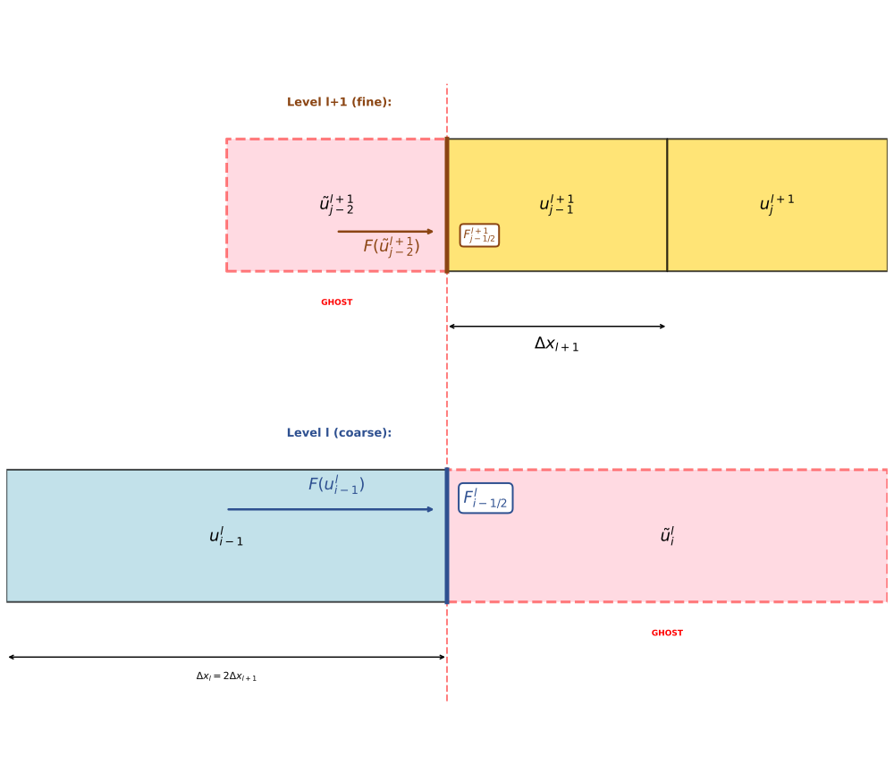

# Naive implementation of the Burgers equation

:::{note} Main Objectives
- Develop skills in implementing finite volume schemes with samurai
- Learn to integrate multi-resolution mesh adaptation
- Recognize the challenges of flux calculation on non-uniform meshes
:::

In this part, we will implement a naive finite volume scheme to solve the one-dimensional inviscid Burgers equation. While this implementation is straightforward, we will see in later sections how to improve it to handle multi-resolution meshes correctly. We will use the Burgers equation as a demonstration. This equation is a fundamental partial differential equation that models various physical phenomena, including fluid dynamics and traffic flow. The inviscid Burgers equation is given by:

$$
\frac{\partial u}{\partial t} + \frac{1}{2} \frac{\partial u^2}{\partial x} = 0.
$$

```{include} start_instructions.md
```

:::{note}
The `step_name` folder is `02-naive-burgers`.
:::

:::{note}
In the provided code skeleton, we impose homogeneous Dirichlet boundary conditions ($u = 0$) at both ends of the domain. samurai provides various ways to implement boundary conditions, which we will explore in later parts.
:::

## Finite volume scheme

We will use the simplest finite volume scheme to solve the Burgers equation. The domain is discretized into control volumes (cells), and the solution is approximated by its average value within each cell. The update formula for the cell average $u_i$ at time step $n+1$ is given by:

$$
u_i^{n+1} = u_i^n - \frac{\Delta t}{\Delta x} \left( F(u_{i+1/2}^n) - F(u_{i-1/2}^n) \right),
$$

where $u_i^n$ represents the cell average of $u$ in the cell $i$ at time step $n$, $\Delta t$ is the time step size, and $\Delta x$ is the cell size. We use a Forward Euler method here to discretize time for simplicity. However, more complex time schemes can be used, as we will show at the end of this practical session. $F(u_{i+1/2}^n)$ is the numerical flux function, which we will define using the upwind flux. For simplicity, we will assume that the velocity is always positive (upwind scheme). The flux at the right interface of cell $i$ is determined by the left state:

$$
F(u_{i+1/2}) = \frac{1}{2} u_i^2
$$

````{exercise}
A code skeleton is provided in `material/02-naive-burgers/main.cpp` to help you get started. Complete the implementation of the naive finite volume scheme for the inviscid Burgers equation.

Ensure that you have correctly implemented the flux calculation by visualizing the evolution of the solution over time using the following command:

```bash
python /path/to/read_mesh.py burgers_1d_ --field u --start 0 --end 340 --wait 10
```
````

## Mesh adaptation

It is time to adapt the mesh according to the solution. We will use the multi-resolution capabilities of samurai to do so. We will not go into the theoretical details of multi-resolution here, but you can refer to [Thomas Bellotti's thesis](https://hal.science/tel-04266822v1) in chapter 2 for more information.

Adding the adaptation step performed by the multi-resolution framework of samurai is straightforward. You simply need to follow these steps:

- Include the multi-resolution adaptation header:

```cpp
#include <samurai/mr/adapt.hpp>
```

- Before the time loop, define the multi-resolution configuration:

```cpp
auto MRadaptation = samurai::make_MRAdapt(u);
auto mra_config   = samurai::mra_config().epsilon(1e-3).relative_detail(false);
````

:::{note}
- The `epsilon` parameter controls the accuracy of the adaptation. A smaller value leads to a finer mesh.
- The `relative_detail` parameter determines whether the detail coefficients are normalized to [0, 1] for each field component (true) or kept at their absolute values (false). This parameter is generally used when the solution values vary significantly in magnitude.
:::

- Inside the time loop, before updating the solution, call the adaptation function and resize the solution field:

```cpp
MRadaptation(mra_config);
unp1.resize();
```

```{note}
The process is always the same: first implement your solver on a fixed mesh, then add multi-resolution adaptation with just a few lines of code!
```

:::{tip}
You can adapt the mesh using a field and update other fields accordingly.

```cpp
auto MRadaptation = samurai::make_MRAdapt(u);

...
MRadaptation(mra_config, other_field1, other_field2, ...);
```
:::

```{important}
Don't forget to resize the fields that are not involved in the adaptation step as well to have the good number of cells and mesh structure for these fields! This is the goal of `unp1.resize()`.
```

```{exercise}
Implement the multi-resolution adaptation step in your code.
```

:::{important}
- Don't forget to change the `min_level` and `max_level` to allow for mesh adaptation. For example, you can set `min_level = 2` and `max_level = 8`.
- Choose the appropriate $\Delta x$ in the `for_each_interval` loop according to the current level of refinement of each cell. You can use the `mesh.cell_length(level)` method to get the information about the cell size at a given level.
:::

You can visualize the adapted mesh and the solution evolution over time using the same command as before. If you add the command-line option `--save-debug-fields` when running your program, samurai will save additional fields that can help you understand how the mesh is adapted over time, such as levels and coordinates.

If you want to visualize these additional fields, you can use the following command:

```bash
python /path/to/read_mesh.py burgers_1d_ --field levels u --start 0 --end 340 --wait 10
```

## Conclusion

In this part, you implemented a naive finite volume scheme for the inviscid Burgers equation using samurai. You learned how to set up the problem, implement the finite volume update, and adapt the mesh using samurai's multi-resolution capabilities.

However, this naive implementation has several issues. Most notably, we do not compute the flux correctly at interfaces between cells of different refinement levels. To understand why this is problematic, consider the conservation property of finite volume schemes.

In a proper finite volume scheme, conservation requires that the flux leaving one cell exactly equals the flux entering its neighbor. This ensures that mass (or any conserved quantity) is neither created nor destroyed at cell interfaces. Mathematically, for two adjacent cells sharing an interface, the flux balance must satisfy:

$$
F_{\text{left}} = - F_{\text{right}}.
$$



At multi-resolution interfaces, the naive approach breaks down because it uses **ghost cells** to compute fluxes. Consider the diagram above:

- **At level $l$ (coarse):** To compute the flux $F_{i-1/2}^l$ on the right side of the real cell $u_{i-1}^l$, we need a neighbor. Since the actual neighbor consists of fine cells at level $l+1$, we create a ghost cell $\tilde{u}_i^l$ (shown in pink with dashed borders).

- **At level $l+1$ (fine):** Similarly, to compute the flux $F_{j-1/2}^{l+1}$ on the left side of the real cell $u_{j-1}^{l+1}$, we need a neighbor. Since the actual neighbor is a coarse cell at level $l$, we create a ghost cell $\tilde{u}_{j-2}^{l+1}$.

The problem is that **these two fluxes are computed at the same physical interface** (shown by the red vertical line), but using different cell and ghost values.

The ghost values are constructed differently on each side, leading to inconsistent flux evaluations. This **breaks conservation** and can cause numerical errors, spurious oscillations, or even instabilities.

In the next section, we will address this by implementing samurai's flux mechanism, which properly accounts for the multi-resolution mesh structure and ensures conservation at all interfaces.
