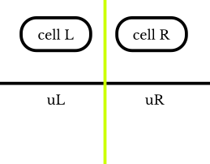

# Flux mechanism in samurai

:::{note} Main Objectives
- Understand and configure samurai’s flux mechanism (nonlinear and linear)
- Implement scalar Burgers convection with fluxes in 1D and 2D
- Extend to the 2D vector Burgers system (non-conservative convection)
- Introduce and combine a diffusion (viscous) operator
:::

In the previous practical session, we implemented a naive finite volume scheme for the inviscid Burgers equation using `for_each_interval`. We explained that this approach can be incorrect when dealing with fluxes at the interfaces between different levels in a multi-resolution mesh. To address this issue, we introduce the concept of fluxes and how to handle them correctly using samurai's built-in flux mechanism. You will also see that the multi-dimensional case is handled in the same way.

```{include} start_instructions.md
```

:::{note}
The `step_name` folder is `03-flux-burgers`.
:::

A comprehensive documentation about the flux mechanism in samurai is available at: [finite volume schemes](https://hpc-math-samurai.readthedocs.io/en/latest/reference/finite_volume_schemes.html). We will provide a brief overview here.

samurai provides three types of schemes to handle fluxes in finite volume schemes:

- the homogeneous linear scheme
- the heterogeneous linear scheme
- the nonlinear scheme

Following our example of the inviscid Burgers equation, we will focus on the nonlinear scheme in this practical session.

The definition of a nonlinear flux-based scheme requires defining a `samurai::FluxDefinition<cfg>` where the config in our case is:

```cpp
using cfg = samurai::FluxConfig<samurai::SchemeType::NonLinear, stencil_size, field_t, field_t>;
```

We can observe that the scheme type is `NonLinear`. The `stencil_size` defines the number of neighboring cells used to compute the flux at a given cell interface. In our case, we will use a stencil size of 2, which means that the flux at the interface between cells `i` and `i+1` will be computed using the values of `u` in cells `i` and `i+1`. The output field type and input field type are both `field_t`, which is the type of the solution field `u`. Note that the output field doesn't always have the same number of components as the input field. For example, in the divergence operator, the input field is a vector and the output field is a scalar.

Now that the config is defined, we need to define the flux function for each Cartesian direction. In the scalar Burgers equation, the flux function is the same in each direction; only the cells change depending on the direction. To construct the flux in samurai, you have to build the following object:

```cpp
samurai::FluxDefinition<cfg> burgers_flux(
        [&](samurai::FluxValue<cfg>& flux, const samurai::StencilData<cfg>& data, const samurai::StencilValues<cfg>& u)
        {
            // Compute flux at the interface using values in u
        });

auto scheme = make_flux_based_scheme(burgers_flux);
```

Let us explain the arguments of the lambda function:

- `flux`: the output flux at the interface between two cells. You need to fill this value using the values of `u`.
- `data`: contains information about the stencil, such as the indices of the cells in the stencil.
- `u`: contains the values of the solution field `u` in the stencil cells.

A figure illustrating the stencil of size 2 for a 1D flux is given below:



`data` will contain an array `data.cells` with two `cell` instances representing `Cell L` and `Cell R`, and an attribute `data.cell_length` containing the length of the cell. `u` will contain the values of the field in these cells: `u[0]` holds the left state (u_L), and `u[1]` holds the right state (u_R).

```{exercise}
Implement the inviscid (scalar) Burgers equation in 1D using the flux mechanism in samurai and the upwind scheme introduced in the previous part.
```

:::{note}
Once you have implemented the flux-based scheme for the 1D Burgers equation, you can use it with lazy evaluation as follows:

```cpp
auto conv = burgers_flux<decltype(un)>();

// in the time loop
unp1 = un - dt * conv(un);
```

This is given in the skeleton code provided in `material/03-flux-burgers/main.cpp`.
:::

```{exercise}
Add mesh adaptation to your 1D Burgers solver, as in the previous part.
```

```{exercise}
Switch to 2D (scalar field) and confirm that the same flux definition is reused for each direction.

:::{attention}
The box and the initial condition must be upgraded to 2D as well.
:::
```

```{exercise}
Add mesh adaptation to your 2D Burgers solver, as in the previous part.
```

:::{exercise}
Previously, the same flux is used in 1D and 2D, which means that the flux doesn't depend on the direction. This is why we set the lambda function for the flux definition only once in the constructor. However, in general, the fluxes can differ across dimensions. To do that, we create a `samurai::FluxDefinition<cfg>` without parameters in the constructor and then set the flux function for each dimension separately:

```cpp
samurai::FluxDefinition<cfg> my_flux;

my_flux[0].cons_flux_function = [](samurai::FluxValue<cfg>& flux, const samurai::StencilData<cfg>& data, const samurai::StencilValues<cfg>& u)
                           {
                               // flux in x-direction
                           };
my_flux[1].cons_flux_function = [](samurai::FluxValue<cfg>& flux, const samurai::StencilData<cfg>& data, const samurai::StencilValues<cfg>& u)
                           {
                               // flux in y-direction
                           };

```

Modify your implementation to create different flux functions for each dimension (x and y), even though they will be identical for this particular problem.
:::

## Write the 2D flux function in non-conservative form

In samurai, you can also define fluxes for non-conservative forms. This means you need to provide two fluxes at each interface in each direction: the flux going from left to right and the flux going from right to left in 1D. A conservative form can be seen as a particular case where the flux going from left to right is the negative of the flux going from right to left. You can find more information about this in the [documentation on implementing a non-conservative scheme](https://hpc-math-samurai.readthedocs.io/en/latest/reference/finite_volume_schemes.html#implementing-a-non-conservative-scheme).

The syntax is the following:

```cpp
samurai::FluxDefinition<cfg> my_flux;

my_flux[0].flux_function = [](samurai::FluxValuePair<cfg>& flux, const samurai::StencilData<cfg>& data, const samurai::StencilValues<cfg>& u)
                           {
                               flux[0] = ...; // left --> right (direction '+')
                               flux[1] = ...; // right --> left (direction '-')
                           };
```

:::{note}
You can observe that the lambda function is now named `flux_function` instead of `cons_flux_function`. This function now takes a `samurai::FluxValuePair<cfg>& flux` as an argument. This object contains two values: `flux[0]` is the flux going from left to right (direction '+'), and `flux[1]` is the flux going from right to left (direction '-').
:::

```{exercise}
Rewrite your 2D scalar Burgers flux function using the non-conservative feature of samurai. Replace `cons_flux_function` with `flux_function` and provide the two fluxes at each interface. Remember that `flux[1] = -flux[0]` in the conservative case.

Call this new flux operator `upwind_conservative_flux`.
```

:::{attention}
We now have a vector field with two components (u,v).
:::

## Vector extension of the viscous Burgers equation

We will now consider the vector extension of the Burgers equation with a viscous term in its non-conservative form:

$$
\mathbf{u}_t + (\mathbf{u}\cdot\nabla)\mathbf{u} = \nu \Delta \mathbf{u}, \qquad \mathbf{u}=(u,v).
$$

### Initial condition: Taylor-Green vortex

The Taylor-Green vortex is a well-known analytical solution of the incompressible Navier-Stokes equations, which can also be adapted for the viscous Burgers equation. The initial condition for the Taylor-Green vortex in 2D is given by:

$$
\begin{aligned}
u(x,y,0) &= -U_0\sin(kx) \cos(ky), \\
v(x,y,0) &= U_0\cos(kx) \sin(ky).
\end{aligned}
$$

where $U_0$ is the characteristic velocity and $k$ is the wave number. This initial condition represents a periodic vortex pattern. The domain is typically taken as the square $[0, 2\pi] \times [0, 2\pi]$ with periodic boundary conditions.

```{note}
The default parameter values are:
- $U_0 = 1.0$
- $k = 1.0$
- $CFL = 0.4$
- $T_{\text{final}} = 5$
- $Re = 100$
- characteristic length $L = \pi$
- $\nu = \frac{U_0 L}{Re}$
```

```{exercise}
- Create a multi-resolution mesh in 2D with periodic boundary conditions.
- Create a vector field `u` with two components representing the velocity field.
- Initialize the field `u` with the Taylor-Green vortex initial condition.
```


### Convective operator

Let's start with the convective part. The x-velocity at the interface is given by:

$$
u_{I} = \frac{u_{L} + u_{R}}{2}.
$$

The flux in the x-direction is computed using an upwind scheme. The formulas for the fluxes at the interface are:

$$
F^x_{L \to R} = -u_{I} \frac{\text{sign}(u_{I}) - 1}{2} (\mathbf{u}_{R} - \mathbf{u}_{L}),
$$

$$
F^x_{R \to L} = u_{I} \frac{\text{sign}(u_{I}) + 1}{2} (\mathbf{u}_{R} - \mathbf{u}_{L}).
$$

:::{note}
The velocity gradient in the previous formulas is given as $(\mathbf{u}_{R} - \mathbf{u}_{L})$. We don't divide by the cell length $h$ here because samurai will take care of it.
:::

```{exercise}
Implement the 2D vector Burgers convective flux in non-conservative form using the same approach as for the scalar case. Note that now `flux[1]` is not equal to `-flux[0]`.

Call this new flux operator `upwind_non_conservative_flux`.
```

:::{tip}
You can use [`std::copysign`](https://en.cppreference.com/w/cpp/numeric/math/copysign) to implement the sign function.
:::


### Diffusion operator

Now it's time to implement the diffusion operator. We will use a linear homogeneous scheme, for which we need to create a new configuration:

```cpp
using diff_cfg = samurai::FluxConfig<samurai::SchemeType::LinearHomogeneous, stencil_size, field_t, field_t>;
```

You can observe that the scheme type is now `LinearHomogeneous`.

The lambda signature changes because coefficients are returned. This allows samurai to build both explicit and implicit schemes. The flux definition changes slightly. Now, you need to define a lambda function with the following signature:

```cpp
samurai::FluxDefinition<diff_cfg> diffusion_flux(
    [&](samurai::FluxStencilCoeffs<diff_cfg>& coeffs, double h)
    {
        // TODO: fill stencil interface coefficients
    });
```

For more details about implementing a linear homogeneous scheme, you can refer to the [documentation on implementing a linear homogeneous scheme](https://hpc-math-samurai.readthedocs.io/en/latest/reference/finite_volume_schemes.html#linear-homogeneous-operators).

:::{caution} Flux definition for diffusion
Remember that the finite volume flux for the diffusion operator at the interface is:
$$
F(u) = \nu \frac{u_R - u_L}{h}
$$
:::

```{exercise}
Implement the diffusion operator and test the Taylor-Green example with a small viscosity ($\nu = 0.001$ for example).
```

## Conclusion

In this part, you have mastered samurai's flux mechanism, a powerful tool that ensures conservation at multi-resolution interfaces. You learned to:

- Configure and use **nonlinear flux schemes** for conservative formulations (scalar and vector Burgers)
- Handle **non-conservative formulations** for coupled systems
- Implement **linear homogeneous schemes** for diffusion operators
- Combine multiple operators (convection + diffusion) in a single solver

The key advantage of samurai's flux mechanism is its **dimension-agnostic nature**: the same flux definition works seamlessly in 1D, 2D, and 3D. You can also define different fluxes by dimension if needed. You also saw how to handle both scalar and vector fields with minimal code changes.

In the next part, you will apply these concepts to the **Euler equations** for compressible gas dynamics. This will require more sophisticated Riemann solvers (Rusanov, HLL, HLLC) and introduce new challenges such as custom boundary conditions and ensuring physical positivity. The flux mechanism you learned here will be the foundation for solving these complex multi-dimensional problems.
