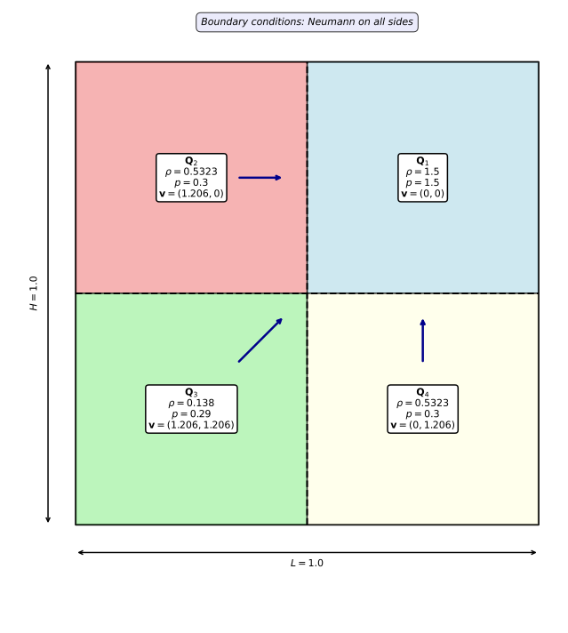
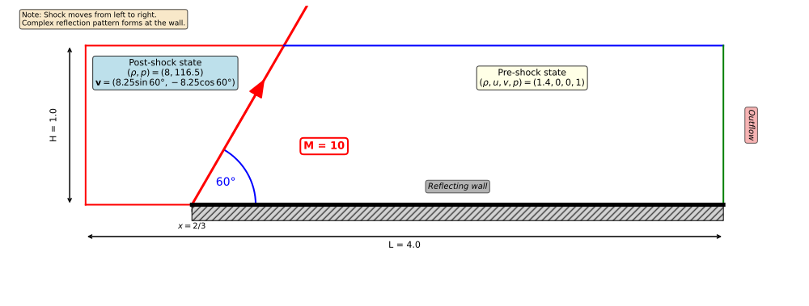

# Euler equations

:::{note} Main Objectives
- Understand the Euler equations for compressible gas dynamics
- Implement three Riemann solvers: Rusanov, HLL, and HLLC
- Apply adaptive mesh refinement to capture shocks and contact discontinuities
- Visualize density, pressure, and velocity fields
:::

In this final part of the practical session, you will implement a complete compressible gas dynamics solver using the Euler equations. This builds upon everything you have learned: mesh creation, field manipulation, flux computation, and adaptive mesh refinement.

The Euler equations describe the motion of inviscid (non-viscous) compressible fluids. They are fundamental in aerodynamics, astrophysics, and shock physics. Unlike Burgers, the Euler system couples four conservation laws (mass, momentum in x and y, energy), requiring more sophisticated numerical schemes.

## Euler equations

The Euler equations in 2D read:

$$
\frac{\partial }{\partial t} \begin{pmatrix}
\rho \\\\ \rho u \\\\ \rho v \\\\ \rho E
\end{pmatrix}
+ \frac{\partial }{\partial x} \begin{pmatrix}
\rho u \\\\ \rho u^2 + p \\\\ \rho uv \\\\ u(\rho E + p)
\end{pmatrix}
+ \frac{\partial }{\partial y} \begin{pmatrix}
\rho v \\\\ \rho uv \\\\ \rho v^2 + p \\\\ v(\rho E + p)
\end{pmatrix}
= 0
$$

where:
- $\rho$ is the density (mass per unit volume)
- $u, v$ are the velocity components in x and y directions
- $\rho E$ is the total energy per unit volume (where $E$ is the specific total energy)
- $p$ is the pressure

where $E = e + \frac{1}{2}(u^2 + v^2)$ is the **specific** total energy (energy per unit mass), with $e$ the internal energy per unit mass.

The pressure is given by the equation of state for an ideal gas:

$$
p = (\gamma - 1) \rho e
$$

where $\gamma$ is the ratio of specific heats (typically 1.4 for air).

### Sound Speed

The sound speed (or speed of sound) is defined as:

$$
c = \sqrt{\frac{\gamma p}{\rho}}
$$

**Physical meaning:** This is the speed at which small pressure disturbances (acoustic waves) propagate through the fluid. It is crucial for:
- Determining the time step (CFL condition)
- Estimating wave speeds in Riemann solvers
- Identifying supersonic vs subsonic flow regimes (Mach number $M = |u|/c$)

## Explanation of the provided code

The Euler code becomes more complex due to the number of equations and the coupling between them. To save time, we provide you with starter code that you can find in the `euler` folder. We will now explain the different parts of the code that will help you in the next steps.

The configuration of the mesh and fields is defined in `config.hpp`.

### Naming convention of the variables

We have defined the numbering of the components of the vector field as follows:
- Component 0: $\rho$ (density)
- Component 1: $\rho E$ (total energy per unit volume)
- Component 2: $\rho u$ (momentum in x)
- Component 3: $\rho v$ (momentum in y)

Once you have created the vector field `conserved` containing the conservative variables, you can access each component using:

```cpp
// For cells
conserved[cell][EulerConsVar::rho]
conserved[cell][EulerConsVar::rhoE]
conserved[cell][EulerConsVar::mom(d)] // d = 0, 1 for x, y

// For intervals
conserved(EulerConsVar::rho, level, i, j)
conserved(EulerConsVar::rhoE, level, i, j)
conserved(EulerConsVar::mom(d), level, i, j)
```

### Conversion between conservative and primitive variables

Next, you need to be able to convert the primitive variables from the conservative ones and vice versa. The primitive variables are:
- $\rho$ (density)
- $u = \frac{(\rho u)}{\rho}$ (velocity in x-direction)
- $v = \frac{(\rho v)}{\rho}$ (velocity in y-direction)
- $p = (\gamma - 1) \left( \rho E - \frac{1}{2} \rho (u^2 + v^2) \right)$ (pressure)

where the notation $(\rho u)$ and $(\rho v)$ represent the momentum components.

The functions `cons2prim` and `prim2cons` defined in `variables.hpp` allow you to convert between these two sets of variables.

### Equation of state

The object `eos` defined in `eos.hpp` allows you to compute the pressure and sound speed from the primitive variables. Here is an example of its usage:

```cpp
auto p = eos::stiffened_gas::p(rho, e);
auto c = eos::stiffened_gas::c(rho, p);
auto e = eos::stiffened_gas::e(rho, p);
```

where `e` is the internal energy per unit mass.

### Time step computation

For explicit time integration, the CFL condition must be satisfied:

$$
\Delta t \leq \text{CFL} \cdot \frac{\Delta x}{\max(|u| + c, |v| + c)}
$$

where the maximum is taken over all cells. A default value is set to $\text{CFL} = 0.4$ in the main function. We provide the `get_max_lambda` function in `utils.hpp` that computes the maximum wave speed in the domain:

```cpp
auto get_max_lambda(const auto& u)
{
    static constexpr std::size_t dim = std::decay_t<decltype(u)>::dim;
    double res                       = 0.;

    const auto& mesh = u.mesh();

    samurai::for_each_cell(mesh,
                           [&](const auto& cell)
                           {
                               auto prim = cons2prim<dim>(u[cell]);

                               auto c = EOS::stiffened_gas::c(prim.rho, prim.p);
                               for (std::size_t d = 0; d < dim; ++d)
                               {
                                   res = std::max(std::abs(prim.v[d]) + c, res);
                               }
                           });
    return res;
}
```

## Numerical schemes

We propose implementing three different schemes for the Euler equations: Rusanov, HLL, and HLLC. Each of these schemes is described below.

### Rusanov scheme

The Rusanov scheme is a simple and robust approximate Riemann solver. The flux function for the Rusanov scheme can be defined as follows:

```math
\mathbf{F}_{\text{Rusanov}}(\mathbf{u}_L, \mathbf{u}_R) = \frac{1}{2} \left( \mathbf{F}(\mathbf{u}_L) + \mathbf{F}(\mathbf{u}_R) \right) - \frac{1}{2} s_{\max} (\mathbf{u}_R - \mathbf{u}_L)
```

where $s_{\max}$ is the maximum wave speed in the direction normal to the interface.

:::{note}$s_{\max}$ definition
**For the x-direction flux:**
$$
s_{\max} = \max(|u_L| + c_L, |u_R| + c_R)
$$

**For the y-direction flux:**
$$
s_{\max} = \max(|v_L| + c_L, |v_R| + c_R)
$$
:::

### HLL scheme

The HLL (Harten-Lax-van Leer) scheme is another approximate Riemann solver that considers only the fastest left-going and right-going waves. The flux function for the HLL scheme is given by:

```math
\mathbf{F}_{\text{HLL}}(\mathbf{u}_L, \mathbf{u}_R) = \begin{cases}
\mathbf{F}(\mathbf{u}_L) & \text{if } s_L \geq 0 \\\\
\mathbf{F}(\mathbf{u}_R) & \text{if } s_R \leq 0 \\\\
\frac{s_R \mathbf{F}(\mathbf{u}_L) - s_L \mathbf{F}(\mathbf{u}_R) + s_L s_R (\mathbf{u}_R - \mathbf{u}_L)}{s_R - s_L} & \text{otherwise}
\end{cases}
```
where $s_L$ and $s_R$ are the estimated speeds of the left-going and right-going waves, respectively.

```math
s_L = \min(u_L - c_L, u_R - c_R)
```

```math
s_R = \max(u_L + c_L, u_R + c_R)
```

where $c_L = \sqrt{\gamma p_L / \rho_L}$ and $c_R = \sqrt{\gamma p_R / \rho_R}$ are the sound speeds on the left and right states.

:::{note}
For the y-direction flux, replace $u$ with $v$ in the wave speed estimates:
$$
s_L = \min(v_L - c_L, v_R - c_R), \quad s_R = \max(v_L + c_L, v_R + c_R)
$$
:::

### HLLC scheme
The HLLC (Harten-Lax-van Leer-Contact) scheme is an extension of the HLL scheme that also captures the contact discontinuity. The flux function for the HLLC scheme is more complex and involves additional wave speed estimates.

#### Contact wave speed

The contact wave speed $s_M$ (also called star region velocity) is computed as:

```math
s_M = \frac{p_R - p_L + \rho_L u_L (s_L - u_L) - \rho_R u_R (s_R - u_R)}{\rho_L (s_L - u_L) - \rho_R (s_R - u_R)}
```

#### Star region states

Let's introduce the intermediate states $\mathbf{u}_L^*$ and $\mathbf{u}_R^*$ in the star region. We first compute the density in the star region:

```math
\rho_K^* = \rho_K \frac{s_K - u_K}{s_K - s_M}
```
where $K \in \{L, R\}$.

The velocity components in the star region remain the same as in the original state, except for the normal velocity which is set to $s_M$.

The fourth component (total energy per unit volume) in the star state is:

$$
(\rho E)_K^* = \rho_K^* \left[ E_K + (s_M - u_K)\left(s_M + \frac{p_K}{\rho_K(s_K - u_K)}\right) \right]
$$

where $E_K = e_K + \frac{1}{2}(u_K^2 + v_K^2)$ is the specific total energy.

Thus, for the x-direction flux, the star region states are given by:

```math
\mathbf{u}_K^* = \rho_K^* \begin{pmatrix}
1 \\\\
s_M \\\\ v_K \\\\
e_K + \frac{1}{2}(u_K^2 + v_K^2) + (s_M - u_K)\left(s_M + \frac{p_K}{\rho_K(s_K - u_K)}\right)
\end{pmatrix}
```

and for the y-direction flux, they are given by:

```math
\mathbf{u}_K^* = \rho_K^* \begin{pmatrix}
1 \\\\ u_K \\\\
s_M \\\\
e_K + \frac{1}{2}(u_K^2 + v_K^2) + (s_M - v_K)\left(s_M + \frac{p_K}{\rho_K(s_K - v_K)}\right)
\end{pmatrix}
```

#### Star region fluxes

The fluxes in the star region are computed as:

```math
\mathbf{F}_K^* = \mathbf{F}(\mathbf{u}_K) + s_K (\mathbf{u}_K^* - \mathbf{u}_K)
```

#### Final HLLC flux

The HLLC flux is then given by:

```math
\mathbf{F}_{\text{HLLC}}(\mathbf{u}_L, \mathbf{u}_R) = \begin{cases}
\mathbf{F}(\mathbf{u}_L) & \text{if } s_L \geq 0 \\
\mathbf{F}_L^* & \text{if } s_L < 0 \leq s_M \\
\mathbf{F}_R^* & \text{if } s_M < 0 < s_R \\
\mathbf{F}(\mathbf{u}_R) & \text{if } s_R \leq 0
\end{cases}
```

This four-wave structure allows the HLLC scheme to resolve contact discontinuities more accurately than the HLL scheme while maintaining robustness.

## Initial conditions

The physical domain is $[0,1] \times [0,1]$. The initial condition consists of a Riemann problem with four constant states separated by discontinuities:

$$
(\rho, u, v, p)(x,y,0) = \begin{cases}
(1.5, 0, 0, 1.5) & \text{if } x < 0.5 \text{ and } y < 0.5 \\\\
(0.5323, 1.206, 0, 0.3) & \text{if } x \geq 0.5 \text{ and } y < 0.5 \\\\
(0.5323, 0, 1.206, 0.3) & \text{if } x < 0.5 \text{ and } y \geq 0.5 \\\\
(0.138, 1.206, 1.206, 0.029) & \text{if } x \geq 0.5 \text{ and } y \geq 0.5
\end{cases}
$$

The boundary conditions are homogeneous Neumann conditions.



The initial condition is provided in the `initial_condition.hpp` file.

## Exercises

To implement and simulate the Euler equations in 2D using samurai, you will need to follow the steps introduced in the previous sections. Here is a summary:

- Set the dimension of your problem
- Create a mesh
- Create a vector field with 4 components (density, x-momentum, y-momentum, energy)
- Define the initial condition
- Define the flux functions for the three schemes presented (Rusanov, HLL, HLLC)
- Create the time loop and apply the scheme at each time step
- Visualize the results using ParaView

If everything is working correctly, you can add adaptive mesh refinement using the multiresolution capabilities of samurai.

:::{note}
Go step by step and test each part of your code before moving to the next one. Start with a uniform mesh at level `8` for example and a simple scheme (like Rusanov) before implementing more complex schemes and adaptive refinement.
:::

```{exercise}
Implement the 2D Riemann problem (Configuration 3) with the following steps:
1. Create a uniform mesh at level 8 on the domain $[0, 1] \times [0, 1]$
2. Implement the initial condition with the four states shown in the figure
3. Implement the Rusanov scheme for the flux computation
4. Run the simulation until $t = 0.3$ with CFL = 0.4
5. Visualize the density field in ParaView

Once this is working, implement the HLL and HLLC schemes and compare the results.
```

### Adding a new case

We now want to implement a new test case: the double Mach reflection problem. This problem involves a Mach 10 shock wave reflecting off a solid wall at a 60-degree angle, creating complex shock interactions and flow features. The following figure illustrates the problem setup:



This problem was introduced by Woodward and Colella (1984) as a challenging test case for high-resolution shock-capturing schemes.

:::{note} Reference
Woodward, P., & Colella, P. (1984). The numerical simulation of two-dimensional fluid flow with strong shocks. *Journal of Computational Physics*, 54(1), 115-173.
:::

The default boundary conditions implemented in samurai are not sufficient for this case, so you will need to create custom boundary condition classes. Samurai provides Dirichlet, Neumann, and periodic boundary conditions, but for this exercise, you will implement a new boundary condition that imposes specific values on the ghost cells.

Let's use the implementation of the Dirichlet boundary condition in samurai as an example to create your own custom boundary conditions.

```cpp
template <class Field>
struct DirichletImpl : public Bc<Field>
{
    INIT_BC(DirichletImpl, 2)

    apply_function_t get_apply_function(constant_stencil_size_t, const direction_t&) const override
    {
        return [](Field& u, const stencil_cells_t& cells, const value_t& dirichlet_value)
        {
            //      [0]   [1]
            //    |_____|.....|
            //     cell  ghost

            u[cells[1]] = 2 * dirichlet_value - u[cells[0]];
        }
    }
};

struct Dirichlet
{
    template <class Field>
    using impl_t = DirichletImpl<Field>;
};
```

:::{note}
- The number 2 in `INIT_BC(DirichletImpl, 2)` indicates that this boundary condition uses a stencil of size 2 (one cell inside the domain and one ghost cell).
- We omit the order parameter in the apply function for simplicity. You can find the full implementation of the Dirichlet boundary condition in samurai [here](https://github.com/hpc-maths/samurai/blob/master/include/samurai/bc/dirichlet.hpp).
:::

```{exercise}
Implement a boundary condition that imposes specific values on the ghost cells. Call this new boundary condition `Value`.
```

You now have all the ingredients to implement the double Mach reflection problem. Using samurai, you can select the boundary cells for each side of the domain as follows:

```cpp
const xt::xtensor_fixed<int, xt::xshape<dim>> bottom = {0, -1}; // Define the direction of the bottom boundary

// If you want to impose a value on all the bottom boundary cells
samurai::make_bc<Value>(u, rho, rhoE, momx, momy)
    ->on(bottom);

// If you want to impose a value depending on the position of the cell
samurai::make_bc<Value>(u,
                        [&](const auto& direction, const auto& cell_in, const auto& coord)
                        {
                            // Return an xt::xtensor_fixed<double, xt::xshape<dim + 2>> representing the value to impose (rho, rhoE, momx, momy)
                        })->on(bottom);
```

:::{note}
- `direction` is an array of integers of size `dim` that indicates the direction going out from `cell_in`.
- `cell_in` is of type `samurai::Cell` and gives the characteristics of the cell inside the domain that has a boundary face.
- `coord` is an array of doubles of size `dim` giving the center of the boundary face.
:::

The double Mach reflection problem requires careful implementation of boundary conditions on each side of the domain. Let's analyze what needs to be done for each boundary:

**Bottom boundary (y = 0):**
- For $x < x_0 = 2/3$: The reflecting wall is in contact with the post-shock state. Apply the post-shock state (left_state) on the ghost cells.
- For $x \geq x_0 = 2/3$: This is a reflecting wall. The density and energy should remain the same as in the interior cell, while the normal velocity component (v) should be reversed. You can achieve this by setting:
  ```cpp
  xt::xtensor_fixed<double, xt::xshape<dim + 2>>{
      u[cell][EulerConsVar::rho],
      u[cell][EulerConsVar::rhoE],
      u[cell][EulerConsVar::mom(0)],
      -u[cell][EulerConsVar::mom(1)]  // Note the minus sign for v-momentum
  }
  ```

**Top boundary (y = 1):**
The shock wave moves with time. At time $t$, the shock position along the top boundary is:
$$x_1(t) = x_0 + \frac{10 t}{\sin(60°)} + \frac{1}{\tan(60°)}$$

- For $x < x_1(t)$: The shock has passed; apply the post-shock state (left_state)
- For $x \geq x_1(t)$: The shock hasn't arrived yet; apply the pre-shock state (right_state)

**Left boundary (x = 0):**
This is an inflow boundary where the post-shock state enters the domain. Apply the post-shock state (left_state) on all ghost cells.

**Right boundary (x = 4):**
This is an outflow boundary. Use Neumann boundary conditions (zero gradient):
```cpp
samurai::make_bc<samurai::Neumann<1>>(u, 0, 0, 0, 0)->on(right);
```

:::{tip}
You can use the `cell.center(0)` and `cell.center(1)` methods to access the x and y coordinates of a cell's center, which is useful for implementing position-dependent boundary conditions.
:::

```{exercise}
Implement the boundary conditions required for the double Mach reflection problem.
```

The initial condition for the double Mach reflection problem divides the domain into two regions separated by the initial shock line. The shock starts at position $(x_0, 0) = (2/3, 0)$ and extends at a 60-degree angle.

**Initial shock geometry:**

The shock line is defined by the equation:
$$x < x_0 + \frac{y}{\tan(60°)}$$

- **Left of the shock line** (post-shock region): Apply the post-shock state with:
  - $\rho = 8.0$
  - $p = 116.5$
  - $\mathbf{v} = (8.25 \sin 60°, -8.25 \cos 60°)$

- **Right of the shock line** (pre-shock region): Apply the pre-shock state with:
  - $\rho = 1.4$
  - $p = 1.0$
  - $\mathbf{v} = (0, 0)$

:::{tip}
To implement this condition, you can iterate over each cell and check if the cell center $(x, y)$ satisfies the condition $x < x_0 + y/\tan(\alpha)$ where $\alpha = 60° = \pi/3$. Remember to convert the primitive variables $(\rho, p, \mathbf{v})$ to conservative variables $(\rho, \rho E, \rho u, \rho v)$ using the `prim2cons` function provided in the code.
:::

```{exercise}
Implement the initial condition for the double Mach reflection problem.
```

```{exercise}
Run the double Mach reflection simulation using the HLLC scheme with uniform mesh at level 8. Visualize the density field at different time steps to observe the shock reflections and interactions.
```

:::{tip}
For the double Mach reflection problem, typical simulation parameters are:
- Domain: $[0, 4] \times [0, 1]$
- Final time: $t = 0.2$
- CFL: 0.4
- Output interval: every 0.01 time units

You should observe the formation of a complex triple-point structure where the incident shock, reflected shock, and Mach stem meet.
:::

### Adaptation issues

If you try to run the double Mach reflection problem with adaptive mesh refinement, you may encounter issues where the density or pressure fields become negative in some regions due to how the multi-resolution algorithm works. The detail computation used for adaptation is based on wavelets, where we compute mean values over cells. This can lead to non-physical negative values for density or pressure during the refinement process when using the prediction operator provided by samurai. This phenomenon is only visible when the stencil size of the prediction operator is greater than or equal to 1 (the default is 1). If you use a prediction of order 0, you should not encounter this issue because you simply copy the value of the parent cell into the newly created child cells.

To avoid this issue, you can provide your own prediction operator that ensures positivity of density and pressure during the prediction step. The idea is to compute the new field values in the newly created child cells using the default prediction operator and then check if the density and pressure are positive. If not, you simply copy the field values from the parent cell into the child cells.

The prediction operator can be added during the creation of the multi-resolution object as follows:

```cpp
auto MRadaptation = samurai::make_MRAdapt(prediction_fn, u);
```

where `prediction_fn` is a function with the following definition:

```cpp
template <std::size_t dim, class TInterval>
class Euler_prediction_op : public samurai::field_operator_base<dim, TInterval>
{
  public:

    INIT_OPERATOR(Euler_prediction_op)

    inline void operator()(samurai::Dim<dim>, auto& dest, const auto& src) const
    {

    }
};

auto prediction_fn = [&](auto& new_field, const auto& old_field)
{
    return samurai::make_field_operator_function<Euler_prediction_op>(new_field, old_field);
};
```

:::{exercise}
Implement a custom prediction operator that ensures positivity of density and pressure during the adaptive mesh refinement process. Follow these steps:

**Step 1: Apply the default prediction**

Start by applying the default prediction of order `pred_order` to compute the values in the child cells:

```cpp
samurai::prediction<pred_order, true>(dest, src)(level, i, index);
```

**Step 2: Prepare for child cell inspection**

Create the indices for the child cells. Remember that when you refine a cell, each parent cell is divided into 4 children in 2D:

```cpp
auto i_f     = i << 1;      // Double the index in x-direction
i_f.step     = 2;           // Set step to 2
auto index_f = index << 1;  // Double the index in y-direction
```

**Step 3: Check for negative density**

For each of the 4 children, check if the density is negative. In 2D, the children are indexed by `(0,0)`, `(1,0)`, `(0,1)`, `(1,1)`:

```cpp
const auto mask_rho =
    (dest(EulerConsVar::rho, level + 1, i_f + 0, index_f + 0) < 0.0) ||
    (dest(EulerConsVar::rho, level + 1, i_f + 1, index_f + 0) < 0.0) ||
    (dest(EulerConsVar::rho, level + 1, i_f + 0, index_f + 1) < 0.0) ||
    (dest(EulerConsVar::rho, level + 1, i_f + 1, index_f + 1) < 0.0);
```

**Step 4: Compute pressure for each child**

For each child cell, compute the pressure from the conservative variables. Remember that:
- $e = E - \frac{1}{2}(u^2 + v^2)$ (internal energy from total energy)
- $p = (\gamma - 1) \rho e$ (equation of state)

Create an array to store the 4 pressure values and compute them:

```cpp
std::array<xt::xtensor<double, 1>, 4> pressure;
for (auto& p : pressure)
{
    p = xt::empty<double>({i.size()});
}

// For child (0,0)
auto rho_00 = dest(EulerConsVar::rho, level + 1, i_f + 0, index_f + 0);
auto e_00 = dest(EulerConsVar::rhoE, level + 1, i_f + 0, index_f + 0) / rho_00;
auto u_00 = dest(EulerConsVar::mom(0), level + 1, i_f + 0, index_f + 0) / rho_00;
auto v_00 = dest(EulerConsVar::mom(1), level + 1, i_f + 0, index_f + 0) / rho_00;
e_00 -= 0.5 * (u_00 * u_00 + v_00 * v_00);
pressure[0] = EOS::stiffened_gas::p(rho_00, e_00);

// Repeat for the other 3 children: (1,0), (0,1), (1,1)
// ...
```

**Step 5: Check for negative pressure**

```cpp
const auto mask_p = (pressure[0] < 0.0) || (pressure[1] < 0.0) ||
                    (pressure[2] < 0.0) || (pressure[3] < 0.0);
```

**Step 6: Apply prediction of order 0 on problematic cells**

For cells where either density or pressure is negative, copy the parent cell value to all children:

```cpp
samurai::apply_on_masked(mask_rho || mask_p,
                         [&](auto& ie)
                         {
                             // Copy parent to child (0,0)
                             xt::view(dest(level + 1, i_f + 0, index_f + 0), ie) =
                                 xt::view(src(level, i, index), ie);

                             // Copy parent to child (1,0)
                             xt::view(dest(level + 1, i_f + 1, index_f + 0), ie) =
                                 xt::view(src(level, i, index), ie);

                             // Copy parent to child (0,1)
                             xt::view(dest(level + 1, i_f + 0, index_f + 1), ie) =
                                 xt::view(src(level, i, index), ie);

                             // Copy parent to child (1,1)
                             xt::view(dest(level + 1, i_f + 1, index_f + 1), ie) =
                                 xt::view(src(level, i, index), ie);
                         });
```

This ensures that physical quantities remain positive during the mesh refinement process.
:::

```{exercise}
Run the double Mach reflection simulation using adaptive mesh refinement with your custom prediction operator. Verify that the simulation runs without issues related to negative density or pressure values.
```
